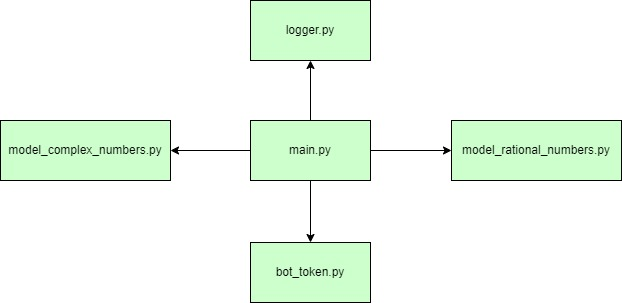
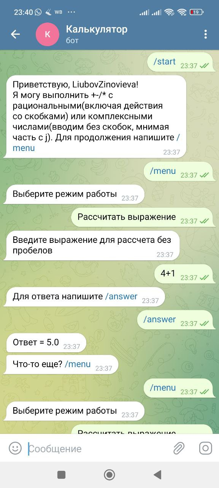
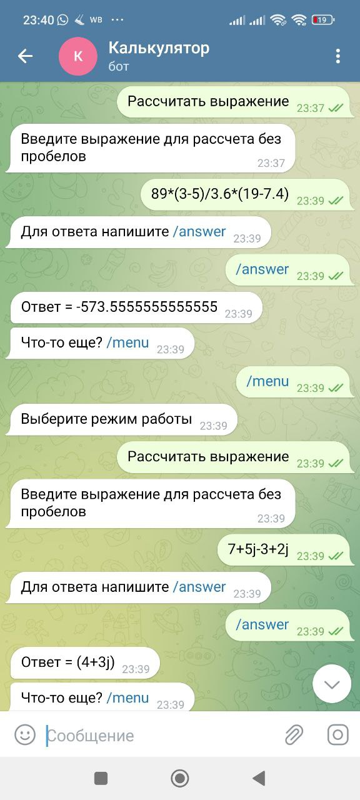
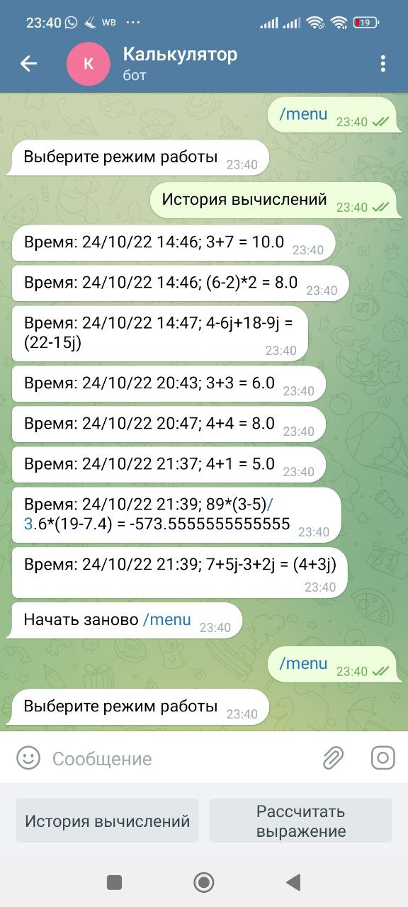

# Бот-калькулятор в telegram: @Lu_calc_bot
Поддерживает вычисления для рациональных и комплексных чисел. Доступны операции */-+. Для рациональных чисел можно считать выражения со скобками.

*Архитектура приложения:*
1. Модуль **main.py** запускает меню, где пользователь выбирает что будет делать: смотреть историю вычислений или выполнять новый расчет. Далее по поступившему выражению определяется содержится ли в нем комплексное число. В зависимости от этого, для вычисления выполняется определенная модель;
2. **model_complex_numbers.py** - модуль вычисления для комплексных чисел
3. **model_rational_numbers.py** - модуль вычисления для рациональных чисел
4. Модуль **logger.py**:
    - log_expression() записывает дату+время и выражение для расчета в log.txt
    - log_ansver() записывает в эту же строку ответ и переходит на новую строку
5. **bot_token.py** хранит токен бота в telegram

*Блок-схема архитектуры приложения.* Схема обусловлена возможностями использованных библиотек telebot и PyTelegramBotAPI

*Пример расчетов для обоих моделей и просмотр истории* 

