# Игра крестики-нолики на основе библиотеки Telebot в telegram: @tictactoe_lu_bot

*Возможности*: 
* Выбор размера игрового поля от 3х3 до 9х9
* Игра с ботом
* Игра с другом

*Архитектура приложения*:
* В **main.py** содержатся все команды и кнопки для бота. Посредством команд узнаем у пользователя    размер поля, режим игры(с другом или ботом) и имя. Случайным образом определяем кто ходим первым и начинаем игру. Узнаем у пользователя номер строки и столбца, куда ходит, заносим данные в массив и проставляем на поле крестик или нолик
* **move.py** использует два метода move_cross() и move_zero(). Они заполняют список, хранящий значения ячеек на игровом поле, крестиком или ноликом соответственно в каждый ход
* Модуль **print.py** распечатывает игровое поле в чате telegram
* **logger.py** сохраняет и загружает id пользователя в файл id.json с помощью методов save() и load(). id пригодится, если мы хотим отправить пользователю сообщения без его команды. Например, чтобы сообщить, что он выиграл при проверке на победу
* **chek_win.py** модуль, проверяющий выигрыш. Смотрим игровое поле и если есть по горизонтали, вертикали или диагонали три нолика/крестика подряд, сообщаем о победе, заканчиваем игру
* **bot_token.py** хранит токен бота, полученный у BotFather

Блок-схема архитектуры приложения: 
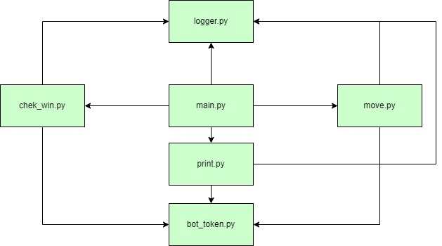

## Примеры запуска программы:

1) **Игра с ботом**
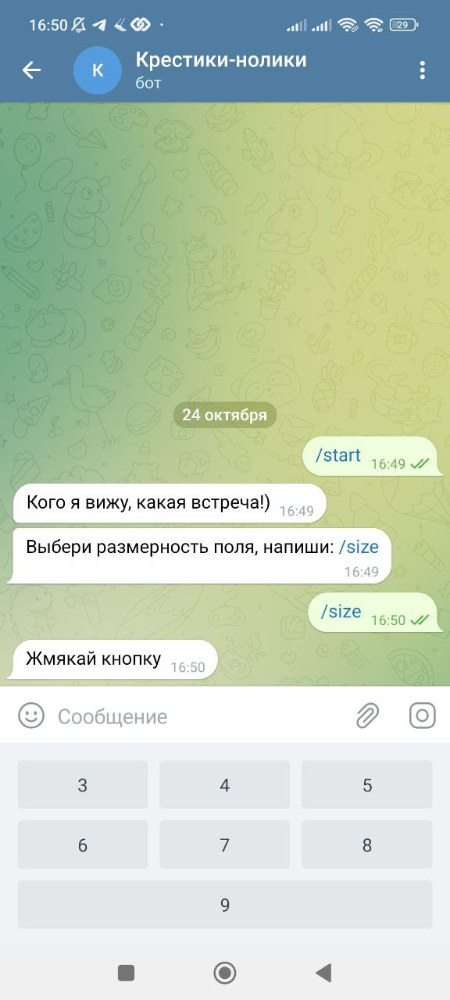
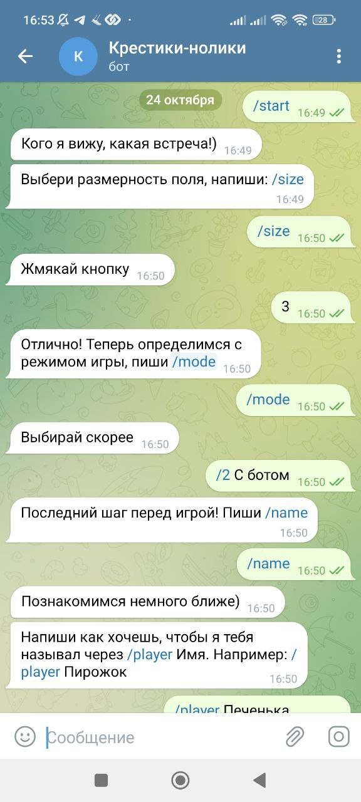
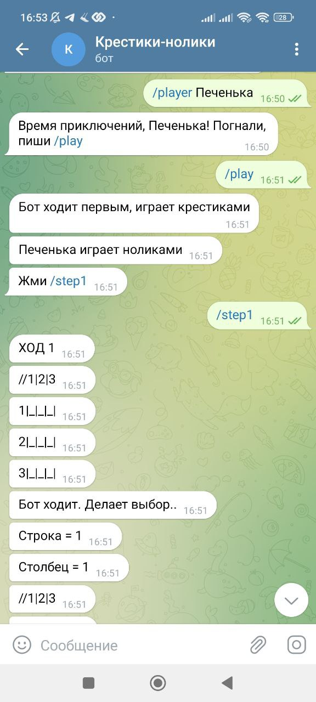
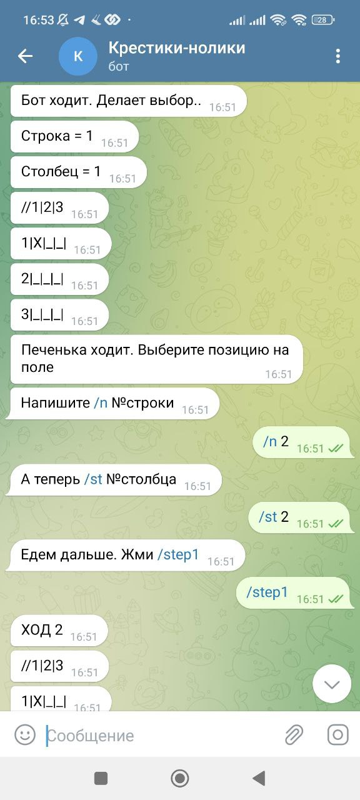
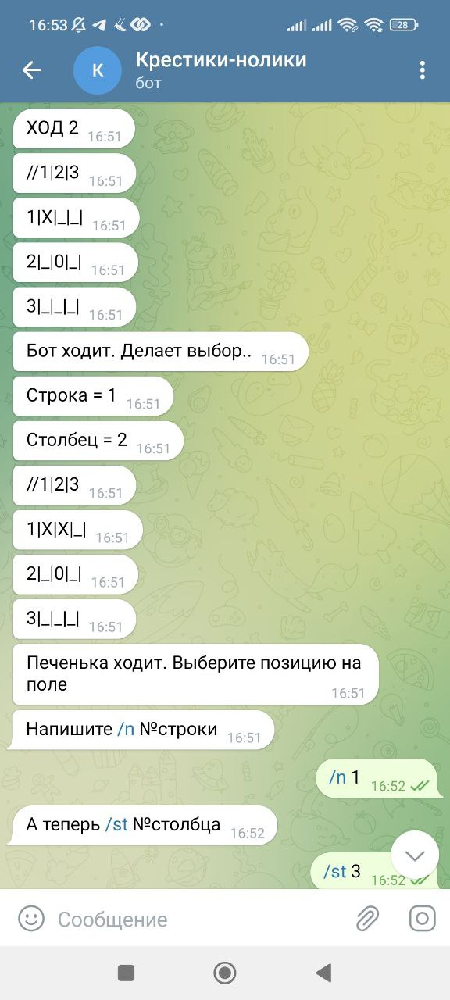
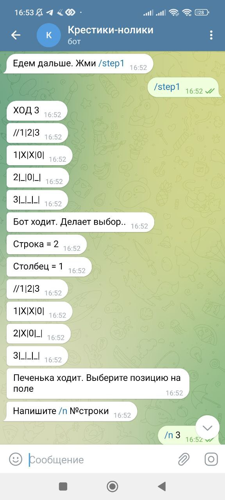
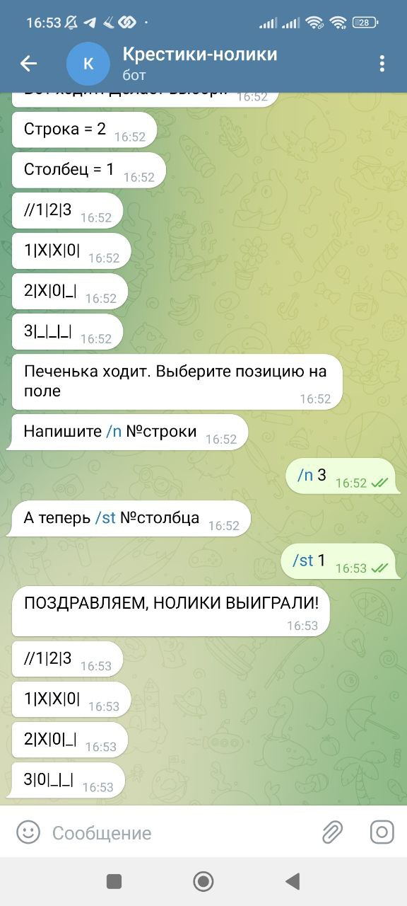

2) **Игра с другом**
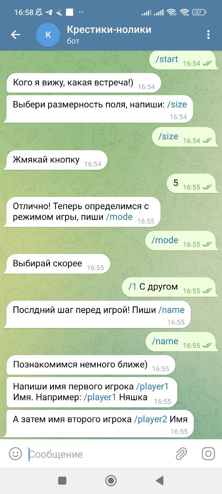
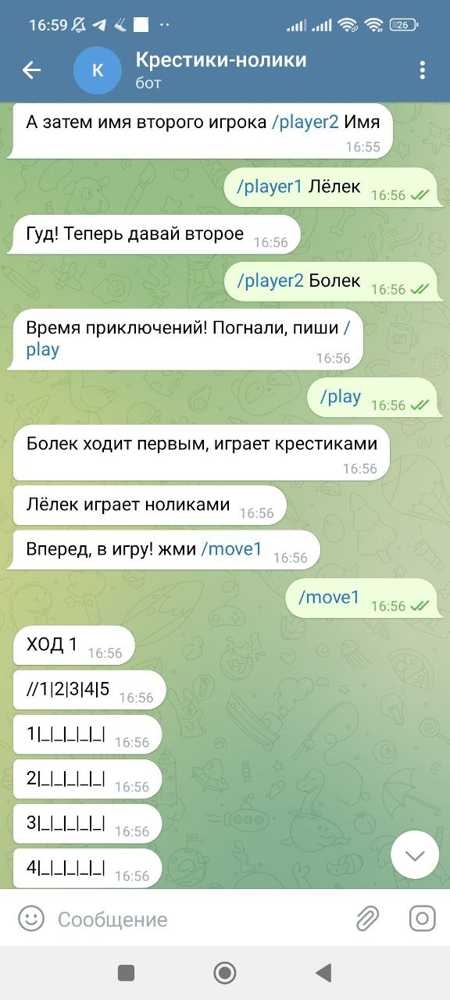
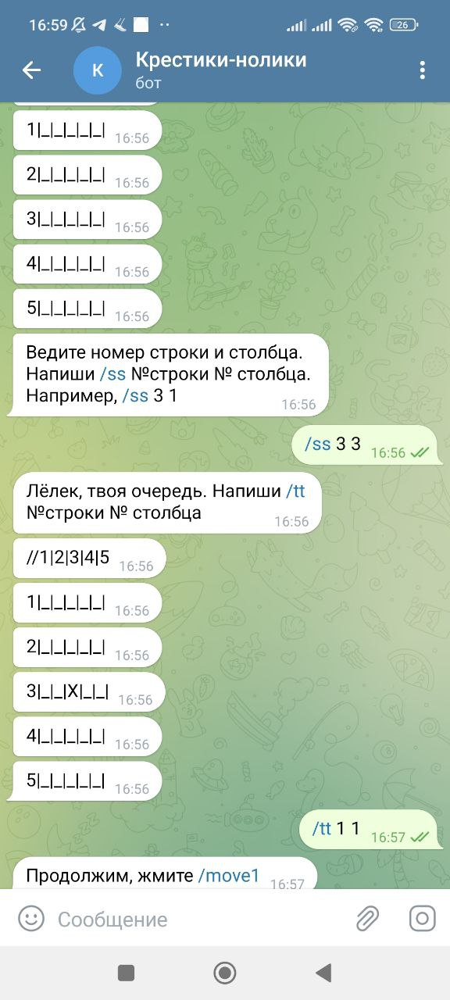
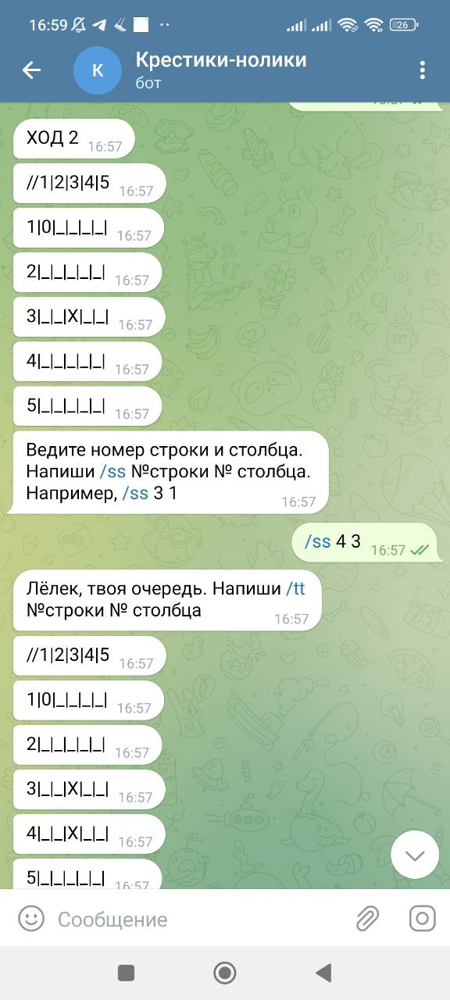
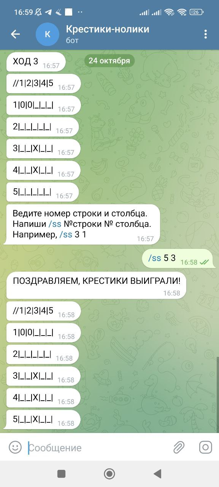
